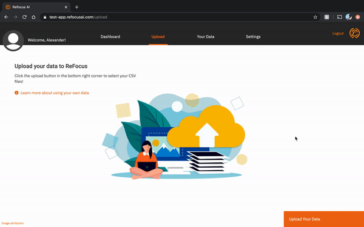
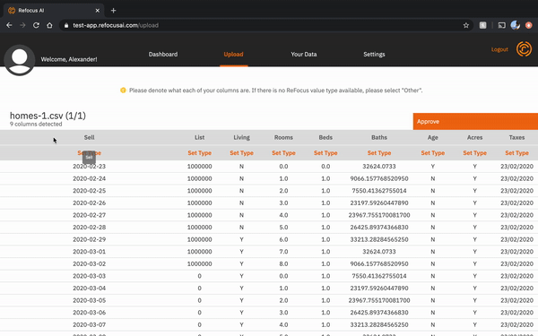
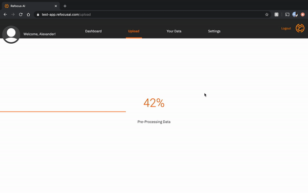
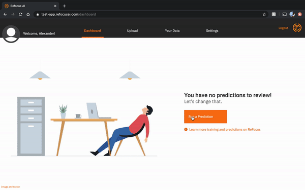

# 0.1.0 Release Notes (MVP+)

The MVP+ release for the ReFocus platform has landed! 🚀

With it comes a plethora of new useful features and enhancements to the ReFocus experience. Scroll down to learn more about what you get in this latest release.

### Upload and train your own data 👨‍💻

Being forced to use ReFocus data was so April 2020.

In MVP+ (v0.1.0), you can now upload your own Book of Business following ReFocus data guidelines, which will then train with the ReFocus AI machine learning model.

After ReFocus trains on your data, you can run predictions on your custom dataset, meaning more accurate and impactful decisions for you and your business.

To upload and train your own Book of Business, navigate to the Upload page by either clicking on the _Upload_ tab in the navigation bar, or clicking on the _Upload Your Own Data_ button on the dashboard (if you have not run any predictions yet).

Click on the _Upload Data_ button. This will open up your operating system’s file picker. Select the CSV file you wish to upload.

When you are satisfied with the file you have uploaded. Click on the green _Review Data_ button. This will take you to the Review stage of the upload process (the most important part)!

In this view, you will need to assign ReFocus columns to your Book of Business’ columns. This process helps us sort out column types and enhance your model training experience. If there aren’t ReFocus columns that match your columns, assign it to “Other”.

**Important Note:** It is important that you assign as many ReFocus columns to your data. Furthermore, there are some columns that are required to be set before submitting your Book of Business. You can learn more about the data requirements here.

After all columns have been assigned, click on the _Approve_ button. If everything has been properly configured the upload and train process will kick off. Depending on the size of your data, it may take up to 5 minutes to upload and process your data.

### Running Predictions against your custom model 🧞‍♂️

What good does a trained model do if you can’t run predictions against it?! Worry not, we’ve baked predictions against custom models right into our MVP+ release. We’ll even give you a confidence score for each prediction!

Even better, your custom trained model shares nothing with anyone you don't want it to. Now that’s what I call social distancing!

To run a prediction, navigate to your ReFocus dashboard.

If you haven’t made any predictions before, the _Make a Prediction_ button will be in the middle of the screen. If you have made predictions in the past, it will be in the top right of the prediction table’s corner.

Clicking on either of these buttons will open up the Prediction modal. Fill in all of the required fields and click on the _Run Prediction_ button.

The prediction should take about 3 seconds to run. Once finished, you will get a message explaining the predicted result in the same prediction model. This information can also be viewed at any time within the Prediction table on your dashboard.

### We also did some (late) Spring cleaning 🧼

- When attempting to delete a prediction, you will now see a prompt confirming the deletion. (Don’t worry you can disable this if you really want to cause mass destruction as quickly as possible)
- We also centered those pesky trash can icons.
- You still can run predictions against the ReFocus model for those of you who are not yet ready to upload your data to ReFocus (don’t worry, we’ll grow on you).
