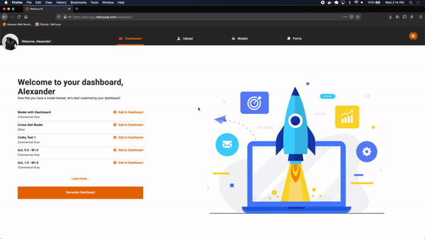

# Release Notes v0.3.0

### Make your insights smarter over time

You are constantly growing your business and now, ReFocus grows with you.

In v0.3.0 you can now append data to an existing model. With this new data, ReFocus will automatically run predictions against your data every night and return them to you for response.

Responses to these automated predictions on your appended data will then be fed back into your existing model for more accurate predictions in the future.

In the ML world this is called Incremental Training - more on that in a bit!

### User Dashboards

ReFocus with Dashboards; catchy, right? With your appended data and automated prediction, you can now create a customized dashboard that pulls in information about any of the models that have been trained within your company.

In v0.3.0, these dashboards will allow you to view automated predictions that have been run for multiple models. These automated predictions can be viewed in a card or list view, depending upon your preference.

The dashboard will also be the location within the application that you respond to your model’s automated predictions for Incremental Training.

### Incremental Model Training

Now that we’ve covered the appending data and user dashboard features, we can finally address the biggest change to v0.3.0 of ReFocus - Incremental Training!

Because your Book of Business is constantly changing, it’s important for your ReFocus models to change with them. By appending data and then responding to the automated predictions generated from that appended data, ReFocus can continuously retrain and update your model to have the most accurate information for your customer base.

The best part about this new feature? You don’t have to do anything!

Every week ReFocus will take the auto-predictions that you have responded to and feed them into your existing models. This means that every Monday morning you are guaranteed to have the most accurate insights to get your week started.

### Company-wide and user notifications

Notifications have finally come to ReFocus!

You and the members of your company will be notified of the following:

- New data uploaded
- New models trained
- New predictions run
- New user activations
- Important ReFocus updates

These notifications can always be turned off.

### Other small enhancements

##### Model identifiers

In order to make the automated dashboard predictions more useful, your models will now be required to contain two unique identifiers. These are set when you create a new model.

##### Enhanced error messages

When uploading data, you now will receive better error messages when your data does not work for the ReFocus system.
