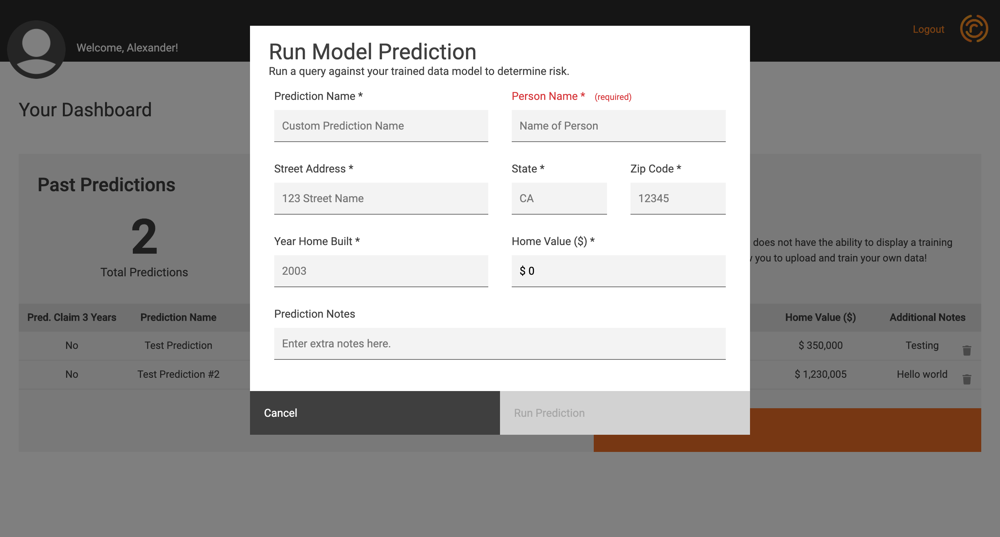
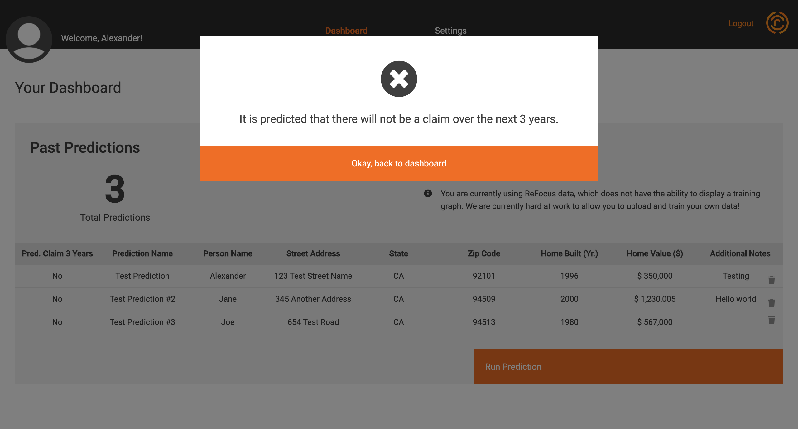
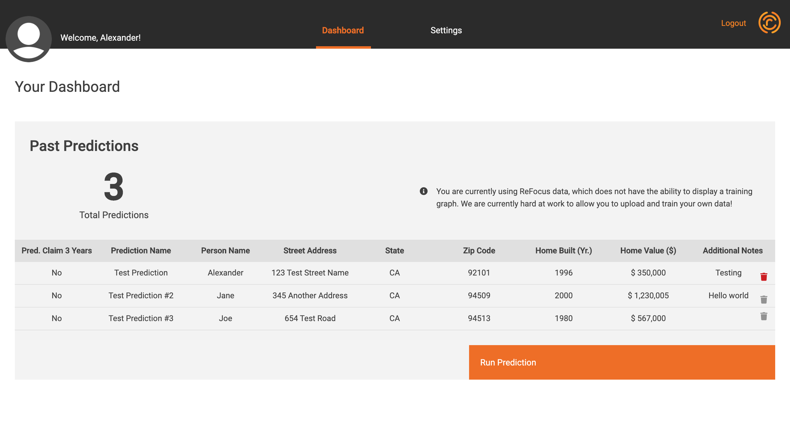

# Release Notes

---

## 0.0.3 Release Notes

Wow! What a journey it has been to get here, and we can't wait to show you what we have in store. You can access our roadmap here to check out what we have under development.

> In this release, we are excited to introduce several new features, and enhancements.

### Required Fields

It’s now easy to see what fields you need to complete before you can run a prediction. It wasn’t clear before, so we put on our glasses and gave it a polish.

### Prediction Results

Running a prediction now generates a clear output.

### Delete a Prediction

Just in time for spring cleaning, you can now delete a prediction from your dashboard to keep the clutter down.
