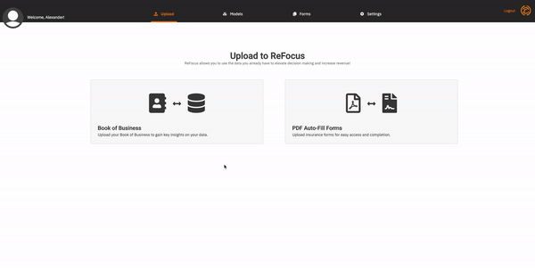
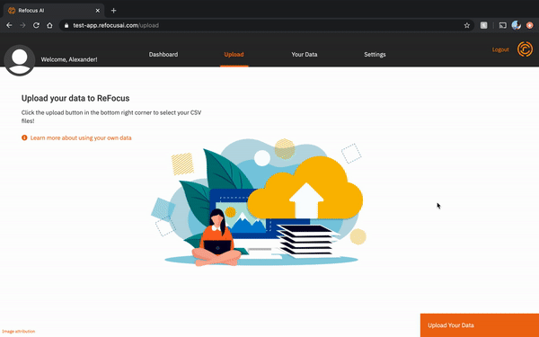
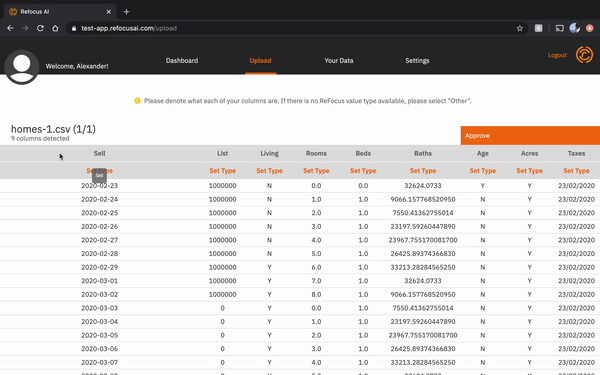
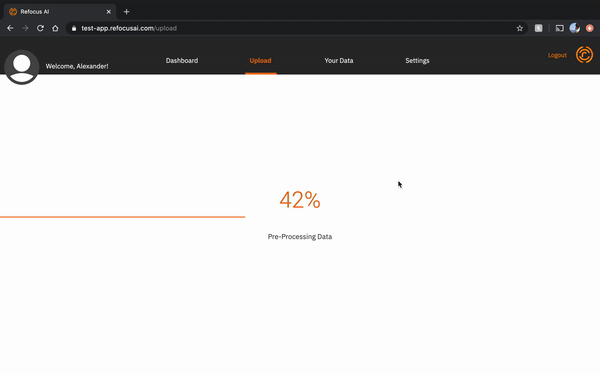

# Release Notes

---

## 0.2.0 Release Notes (Beta)

The release of v0.2.0 of the ReFocus AI application marks the start of our Beta. With it, comes many exciting and revolutionary features for the commercial insurance industry!

### Upload custom Book of Business Data

You can now upload your own Book of Business dataset with no limitations on the number or data types (e.g. numerical, categorical, date/time) of columns.

Uploading a dataset is as easy as:

1. Navigating to the _Upload_ tab in the top navigation bar
2. Clicking on the _Book of Business_ card
3. Clicking on the _Upload a CSV_ button
4. Choose your CSV
5. Click _Upload_

Clicking upload will automatically take you to a screen to train a custom AI model on this dataset.

_Note:_ To train a model successfully, your dataset needs to have one column with binary values (1/0, Yes/No, etc)

### Training a Custom Model

The data you train on and the columns you predict on are now fully under your control.

Training a custom model is as easy as:

1. Navigating to the _Models_ tab in the top navigation bar
2. Clicking on the _Create New Model_ bottom in the bottom right corner of the screen
3. Filling out the relevant information about your model
4. Choosing a previously uploaded dataset to train on
5. Choosing which column to predict on
6. Confirming the categorizing your dataset’s column types
7. Clicking on _Train Model_ button in the bottom right corner of the screen

Once the training has started, you will see the status of its training on the individual model’s information screen and the model overview screen!

_Note:_ To train a model successfully, your dataset needs to have one column with binary values (1/0, Yes/No, etc)

### Uploading PDF Forms for Auto-filling

New in ReFocus Beta is the ability to save hours of data entry and auto-fill PDF forms.

Prior to auto-filling a form, you must upload the PDF and confirm that ReFocus has correctly detected the form fields.

Uploading a PDF form is as simple as:

1. Clicking on the _Forms_ link in the top navigation bar
2. Clicking the _Upload New Forms_ button in the bottom right corner of the screen
3. Clicking the _Upload PDF_ button in the bottom left corner
4. Selecting your PDF
5. Making sure that all the form inputs have been detected by ReFocus and are of the right data type (e.g. text field, date field, or checkbox)
6. Click the _Save to ReFocus_ button in the bottom left corner of the screen

#### Adding inputs

If ReFocus does not detect an input, click where the input starts, drag your cursor over the entire input, and click one more time to end the selection area.

A pop-up will show for you to describe the input’s information. Fill out the information and click the save button to add the input to the PDF.

#### Removing inputs

If ReFocus adds an input incorrectly, or you do not want an input to be auto-populated, hover over the orange selection and click on the trash can icon to remove it from the PDF.

### Auto-Fill PDF Forms

ReFocus Beta allows you to upload a CSV with matching data to a PDF’s form inputs. Each row of the CSV data will be auto-filled into the PDF form and be saved with a collection of PDFs in a zipped file.

To start the auto-fill of a form, navigate to the _Forms_ tab in the ReFocus app.

You can either auto-fill a PDF you have already uploaded, or use one of the pre-loaded forms ReFocus provides. You can find these either in the recents list or searching for the form.

Click on the form you wish to auto-fill from the _recents list_ or search results to start the process.

Click on the _Upload CSV_ button to start the auto-fill. Once uploaded, you will be able to review the CSV.

After confirming everything is correct, click on the _Confirm_ and _Auto-fill_ button. Your PDF auto-fill will begin.

When ReFocus has auto-filled the PDF with the CSV data, a zipped folder will automatically download to your computer with the completed forms.

_Note:_ In order for the ReFocus app to properly auto-fill your PDFs, your CSV headers must **exactly** match the input names contained in your PDF!

### Manage Users in Your Company

We have added a new user management system to ReFocus in Beta!

If you are your company’s administrator user, navigate to the settings page and scroll down to the _User Management_ section.

Click on the _Add a User_ link to show the Add User form. Complete the user information and click Add to send an account activation link to that user.

Once they have activated their account, a green check mark will appear next to their user in the settings page.

If you need to remove a user, click on the _Remove User_ link. Please note that this will permanently delete the user and cannot be undone. All of the deleted user’s uploaded data and trained models will remain on the platform, accessible to other individuals at the company.

## 0.1.0 Release Notes (MVP+)

The MVP+ release for the ReFocus platform has landed! 🚀

With it comes a plethora of new useful features and enhancements to the ReFocus experience. Scroll down to learn more about what you get in this latest release.

### Upload and train your own data 👨‍💻

Being forced to use ReFocus data was so April 2020.

In MVP+ (v0.1.0), you can now upload your own Book of Business following ReFocus data guidelines, which will then train with the ReFocus AI machine learning model.

After ReFocus trains on your data, you can run predictions on your custom dataset, meaning more accurate and impactful decisions for you and your business.

To upload and train your own Book of Business, navigate to the Upload page by either clicking on the _Upload_ tab in the navigation bar, or clicking on the _Upload Your Own Data_ button on the dashboard (if you have not run any predictions yet).

Click on the _Upload Data_ button. This will open up your operating system’s file picker. Select the CSV file you wish to upload.

When you are satisfied with the file you have uploaded. Click on the green _Review Data_ button. This will take you to the Review stage of the upload process (the most important part)!

In this view, you will need to assign ReFocus columns to your Book of Business’ columns. This process helps us sort out column types and enhance your model training experience. If there aren’t ReFocus columns that match your columns, assign it to “Other”.

**Important Note:** It is important that you assign as many ReFocus columns to your data. Furthermore, there are some columns that are required to be set before submitting your Book of Business. You can learn more about the data requirements here.

After all columns have been assigned, click on the _Approve_ button. If everything has been properly configured the upload and train process will kick off. Depending on the size of your data, it may take up to 5 minutes to upload and process your data.

### Running Predictions against your custom model 🧞‍♂️

What good does a trained model do if you can’t run predictions against it?! Worry not, we’ve baked predictions against custom models right into our MVP+ release. We’ll even give you a confidence score for each prediction!

Even better, your custom trained model shares nothing with anyone you don't want it to. Now that’s what I call social distancing!

To run a prediction, navigate to your ReFocus dashboard.

If you haven’t made any predictions before, the _Make a Prediction_ button will be in the middle of the screen. If you have made predictions in the past, it will be in the top right of the prediction table’s corner.

Clicking on either of these buttons will open up the Prediction modal. Fill in all of the required fields and click on the _Run Prediction_ button.

The prediction should take about 3 seconds to run. Once finished, you will get a message explaining the predicted result in the same prediction model. This information can also be viewed at any time within the Prediction table on your dashboard.

### We also did some (late) Spring cleaning 🧼

- When attempting to delete a prediction, you will now see a prompt confirming the deletion. (Don’t worry you can disable this if you really want to cause mass destruction as quickly as possible)
- We also centered those pesky trash can icons.
- You still can run predictions against the ReFocus model for those of you who are not yet ready to upload your data to ReFocus (don’t worry, we’ll grow on you).

---

## 0.0.3 Release Notes

Wow! What a journey it has been to get here, and we can't wait to show you what we have in store. You can access our roadmap here to check out what we have under development.

> In this release, we are excited to introduce several new features, and enhancements.

### Required Fields

It’s now easy to see what fields you need to complete before you can run a prediction. It wasn’t clear before, so we put on our glasses and gave it a polish.

### Prediction Results

Running a prediction now generates a clear output.

### Delete a Prediction

Just in time for spring cleaning, you can now delete a prediction from your dashboard to keep the clutter down.
