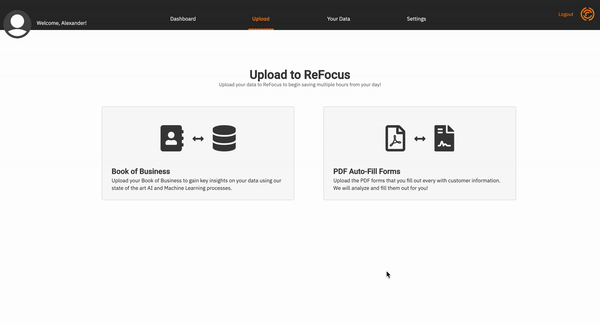
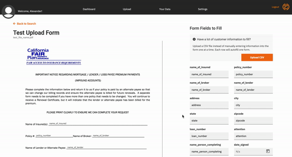

# MVP+

> Planned Release on May 15th

- Agents and Brokers can upload specific fields of their Book of Business to predict the likelihood of a claim at a specific address within three years.
- Users can visualize how well the machine learning solution is performing using their data.

# Beta 1.0

> Coming July 15th

## AI Prediction

### Pinpoint Hidden Risk

Agents and Brokers can pinpoint risk for all lines of commercial insurance by uploading their Book of Business into ReFocus

### Drive Retention

ReFocus utilizes AI to highlight and target clients at risk of defection with loyalty initiatives to prevent churn.

## Automation

### Complete PDF Forms with Input Detection for Autofill

Insurance PDF forms are numerous and time intensive to fill out. In Beta 1.0, ReFocus allows you to upload PDF forms that you use daily for easy completion.

Once uploaded, ReFocus detects and highlights fillable fields in orange. New fields can be added with drag-and-drop functionality. You can rename or remove these auto-detected form inputs by clicking on the highlighted areas.

### PDF Forms in your browser

ReFocus makes it simple to complete uploaded PDF forms in your web browser.

### PDF Form CSV Autofill

To easily complete multiple different forms, you can upload a CSV file. Once complete, download the forms to your desktop..
